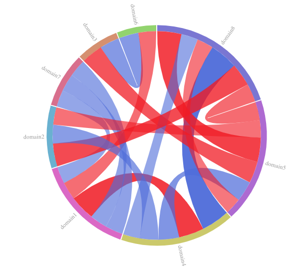
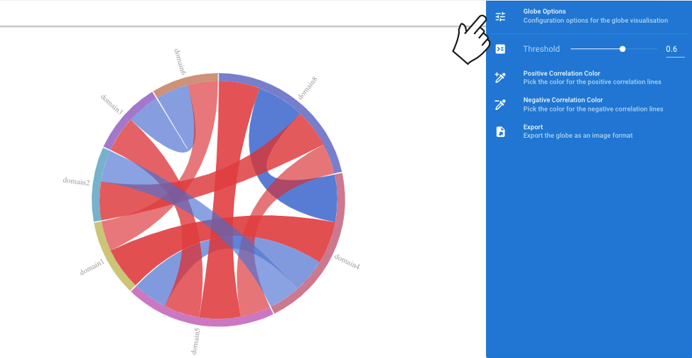
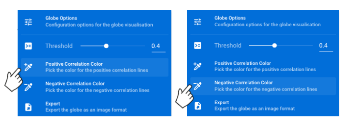
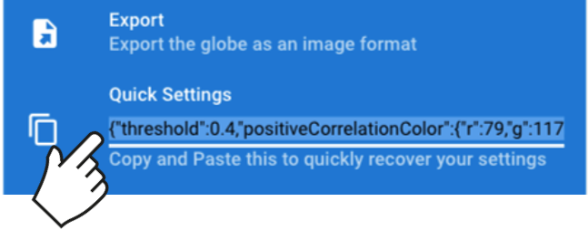

# {{ $attrs.title }} 

GlobeCorr is a data visualization software developed to facilitate the viewing and analysis of multiple correlation datasets. To enable further, dynamic exploration of your data, users can upload a table of correlations in csv format and GlobeCorr provides an interactive and customizable “globe-based” visualization.  

Please note that Firefox has known issues when exporting from this site. Please consider switching to Chrome or Safari for optimal results. 

You can see a static example of a correlation globe below. The domains specified your csv will be shown around the circumference of the globe. Each domain will be present as a distinct arc with a unique colour. Correlations are represented as ribbons. When there are correlations between variables within the same domain, you will see the ribbon tracing back onto its domain of origin. When correlated variables are in separate domains, the ribbons will arrange as needed across the circle to reach the required domain. The variables specified in the csv for the  correlations can be viewed by hovering over each ribbon. The default colour for positive correlations is blue, whereas the default for negative is red. GlobeCorr defaults to showing on those correlations above 0.4. 

GlobeCorr users can customize their image by changing: 
* default correlation threshold 
* colour of positive and negative correlation ribbons 
* opacity of the correlation ribbons 
* arrangement of domains around the circumference 

Please note that by leaving the "Globe Analysis" page, you will lose any customization that has been done to your correlation globe. 

To explore GlobeCorr, you can download our [sample datasets](/sample_small.csv) or view the correlation globe [directly](/globe?view=%2Fsample_small.csv).

Please see our [FAQ](/faq) for more information.  
\
\
\

## **1. Upload your data**

To upload data, click the "Upload data to visualize" bar at the top of the page. 

GlobeCorr requires a 5 column dataset in .csv format. There are required headings for each of the columns, which are shown below. 
If you would like an example, feel free to download one of our [sample datasets](/sample_small.csv). 

+ **Column 1:** variable1
+ **Column 2:** var1_domain
+ **Column 3:** variable2
+ **Column 4:** var2_domain
+ **Column 5:** coef

After loading your data, the image will render automatically. 

## **2. Customize your view**

- As default, only correlations above 0.4 are shown. Red ribbons represent negative correlations, while blue represent positive. All domains specified in the input file are included, but can be faded out.

- Currently, the GlobeCorr diagram renders relative to the size of the user's screen. This can result in domain names being cut off if they are too long. It is best practice to avoid using long domain names, but we are actively working to remedy this problem. 

**Change what correlations are shown** 

- Change the correlation threshold for the globe by hovering over the "Globe Options" <i class="v-icon mdi mdi-tune" style="background-color:#1976d2;color:white;"></i> menu on the right hand side of the screen. Use the slider to select your desired threshold. You can also click on the box to the right of the slider and type in the desired threshold. The visualization will update automatically. 

- To remove domains from the visualization, click on its location at the circumference. The correlation ribbons will disappear, but a small grey box will remain at the circumference representing the hidden domain should the user want to include those correlations again. 

- To explore all correlations within a specific domain, hover over the domain on the circumference of the circle and all correlations within that domain will go from transparent to opaque. 

- To explore specific correlations, hover over the ribbons on the interior of the circle to see the variable and their corresponding correlation coefficient. 

**Layout and colouring**

- The orientation of the domains around the circumference of the circle can be changed by clicking the domain and dragging. However, you will need to move other domains to accomodate the changes. It is possible to have domains overlapping. 

- To update the colour of the ribbons shown in the globe, hover over the "Globe Options" <i class="v-icon mdi mdi-tune" style="background-color:#1976d2;color:white;"></i> menu on the right hand side of the screen. To change the colours for positive corrlations, click "Positive Correlation Colour". Colours can be selected several ways: 
  + Select preset colour
  + Select using slider (opacity can also be changed this way)
  + Selecting a colour on the palette. 
  + Specify RGB code

-  To change the colours for negative corrlations, click "Negative Correlation Colour" and follow the same procedure for positive correlations. The colours will update automatically. 

 ## **3. Save your results** 

- To save the image, hover over the "Globe Options" <i class="v-icon mdi mdi-tune" style="background-color:#1976d2;color:white;"></i> menu on the right hand side of the screen. Click on the "Export" button and select an output format. After selecting an export format the download will start automatically. If your image does not download automatically, check yor browser security settings. 

- To send the image directly to the printer hover over the "Globe Options" <i class="v-icon mdi mdi-tune" style="background-color:#1976d2;color:white;"></i> menu on the right hand side of the screen. Click on the "Export" button, then click "Send to printer" and follow the instructions for your printer. 

- If you want to keep a record of the custom settings used for you image, hover over the "Globe Options" <i class="v-icon mdi mdi-tune" style="background-color:#1976d2;color:white;"></i> menu on the right hand side of the screen. Under 'Quick Settings', you will see a dynamic textbox that will update as you change the settings in your diagram. You can copy this text to save it. In the event you wish to replicate the settings, paste the saved text into the box, being sure to completely overwrite the original text. 

## **4. Running Locally**  
GlobeCorr is already running locally, we are not storing any data on our servers. You can also run GlobeCorr offline. See the following links for how to execute this in [Chrome](https://support.google.com/chrome/answer/7343019?co=GENIE.Platform%3DDesktop&hl=en) or [Safari](https://support.apple.com/en-ca/HT200294). 

