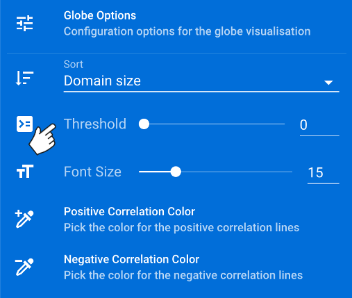
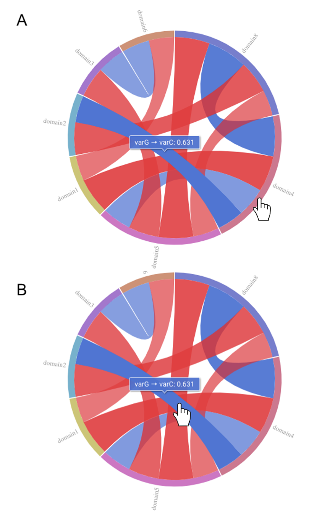
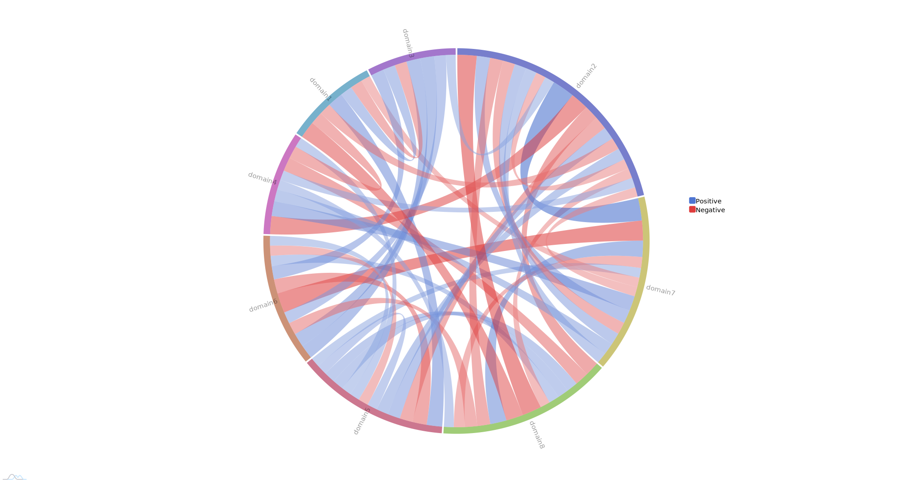
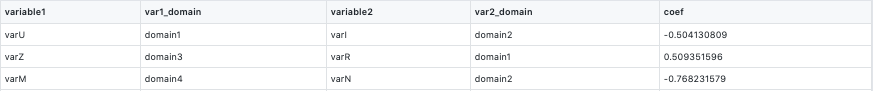
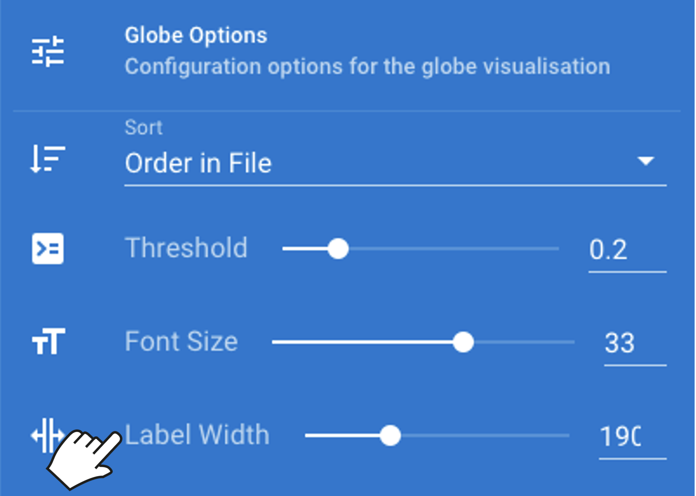
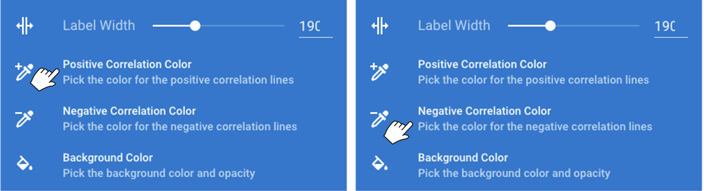
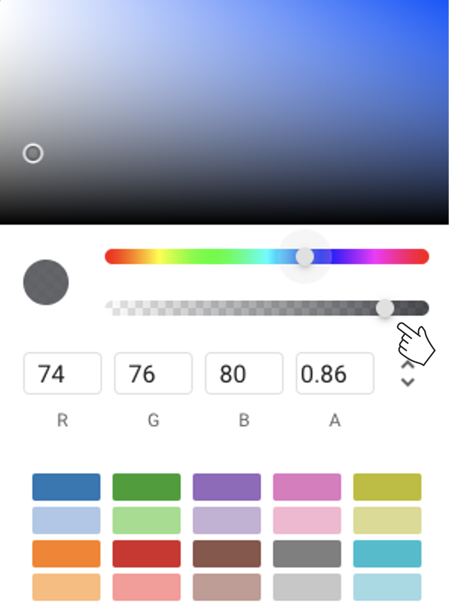

# {{ $attrs.title }} 

GlobeCorr is a data visualization software developed to facilitate the viewing and analysis of multiple correlation datasets. To enable dynamic exploration of their data, users can upload a table of correlations in csv format and GlobeCorr provides an interactive and customizable “globe-based” visualization.  

Please note that Firefox has known issues when exporting from this site. Please consider switching to Chrome or Safari for optimal results. 

A static example of a correlation globe is shown below. The domains specified in the csv will be shown around the circumference of the globe, with the largest domain shown first when going clockwise from the 12 o'clock position. Each domain will be present as a distinct arc with a unique colour. Correlations are represented as bands. When there are correlations between variables within the same domain, you will see the ribbon tracing back onto its domain of origin. When correlated variables are in separate domains, the bands will arrange as needed across the circle to reach the required domain. The variables specified in the csv for the  correlations can be viewed by hovering over each ribbon. The default colour for positive correlations is blue, whereas the default for negative is red. There is a legend present in the plot area to reflect the colours of the correlations. GlobeCorr defaults to showing all correlations. 

GlobeCorr users can customize their image by changing: 
* default correlation threshold 
* arrangement of domains around the circumference 
* color of positive and negative correlation bands
* background color
* size of text and width of labels

Please note that by leaving the "Globe Analysis" page, you will lose any customization that has been done to your correlation globe. 

To explore GlobeCorr, you can download our [sample dataset](/sample_small.csv) and follow along with the tutorial. You can also view a sample globe using the links below. Please see our [FAQ](#/faq) for more information. 

#### **Sample Globes**
- [simple sample globe](#/globe?view=%2Fsample_small.csv) 
- [complex sample globe](#/globe?view=%2Fsample.csv)  
 

## **1. Load your data**

To upload data, click the "Upload data to visualize" bar at the top of the page, a file explorer will appear, and you can select your data. Alternatively, you can drag and drop your file into the 'Globe Analysis' window.  

GlobeCorr requires a 5 column dataset in .csv format, it will not accept any other format. There are required headings for each of the columns, which are shown below. 

If you would like an example, feel free to download one of our [sample datasets](/sample_small.csv). 

+ **Column 1:** variable1
+ **Column 2:** var1_domain
+ **Column 3:** variable2
+ **Column 4:** var2_domain
+ **Column 5:** coef

After loading your data, the image will render automatically. If you upload another csv, the image will automatically update. 

## **2. Customize your view**

- By default, all correlations are shown. Red bands represent negative correlations, while blue represent positive. All domains specified in the input file are included but can be faded out.

### Correlation Thresholds

- Change the correlation threshold for the globe by hovering over the "Globe Options" <i class="v-icon mdi mdi-tune" style="background-color:#1976d2;color:white;"></i> menu on the right hand side of the screen. Use the slider to select your desired threshold. You can also click on the box to the right of the slider and type in the desired threshold. These values must be between 0-1. The visualization will update automatically. 

- To remove domains from the visualization, click on its location at the circumference. The correlation bands will disappear, but a small grey box will remain at the circumference representing the hidden domain should the user want to include those correlations again. Please note that using this feature will reset any domain rearrangements that were previously set.

- To explore all correlations within a specific domain, hover over the domain on the circumference of the circle and all correlations within that domain will go from transparent to opaque (Globe A). 

- To explore specific correlations, hover over the bands on the interior of the circle to see the variable and their corresponding correlation coefficient (Globe B). 

### Domain Layout
- There are several ways to arrange the domains. First, the domains can be arranged manually by the user. The orientation of the domains around the circumference of the circle can be changed by clicking the domain and dragging. However, you will need to move other domains to accomodate the changes. It is possible to have domains overlapping. **Users please note that clicking domains on or off will reset any rearrangements**.
 
- Domains can also be automatically sorted two ways. To switch the way the domains are sorted and plotted around the circumference of the globe, hover over the "Globe Options" <i class="v-icon mdi mdi-tune" style="background-color:#1976d2;color:white;"></i> menu on the right hand side of the screen. Then click on the menu options under "Sort".

 

The default is by domain size, shown in the image below.  Domain 2 is the largest, therefore it is the first domain shown when going in a clockwise direction. 

Users can also sort domains based on the input order in their csv. Below is an example of the input csv and the globe created. When "Document order" is selected, the arrangement goes row by row, so the clockwise order will be domain 1, domain 2, domain 3 (as opposed to domain 1, domain 3, domain 4 if it was going down the column)  
   
      
      

 

 

### Font Size and Labels

- To change the font size in the image, hover over the "Globe Options" <i class="v-icon mdi mdi-tune" style="background-color:#1976d2;color:white;"></i> menu on the right hand side of the screen. Below the threshold slider is a slider that can be used to update the font size. Users can also set the desired font size in the box to the right of the slider by typing or using the arrows. 

- The labels around the globe will automatically wrap as the font size gets larger and larger. To modify this, users can hover over the "Globe Options" <i class="v-icon mdi mdi-tune" style="background-color:#1976d2;color:white;"></i> menu on the right hand side of the screen. Below the Font Size slider there is a slider for label width. Users can increase or decrease the amount of space used by the labels by using the slider, setting the desired label with in the box to the right of the slider by typing or using the arrows. Users please note that increaseing the label width will decrease the size of the globe. 

### Globe Coloring and Background Colors
- To update the color of the bands shown in the globe, hover over the "Globe Options" <i class="v-icon mdi mdi-tune" style="background-color:#1976d2;color:white;"></i> menu on the right hand side of the screen. To change the colors for positive correlations, click "Positive Correlation Color". Colors can be selected several ways: 
  + Select preset colour
  + Select using slider
  + Selecting a color on the palette. 
  + Specify RGB code

-  To change the colors for negative correlations, click "Negative Correlation Color" and follow the same procedure for positive correlations. The colors will update automatically. 

- A legend is also present in the plot area and will reflect the updated colors of your visualization. 

- To change the background color, users can hover over the "Globe Options" <i class="v-icon mdi mdi-tune" style="background-color:#1976d2;color:white;"></i> menu on the right hand side of the screen, and find the option for "Background Color". After clicking on "Background Color", a palette will pop up with several options. For the background color to change, ensure that the opacity of the background has been turned up as indicated in the image below. Once the opacity is increased, the background colour can be changed several ways: 
  + Select preset colour
  + Select using slider
  + Selecting a color on the palette. 
  + Specify RGB code

 ## **3. Saving Results** 

- To save the image, hover over the "Globe Options" <i class="v-icon mdi mdi-tune" style="background-color:#1976d2;color:white;"></i> menu on the right hand side of the screen. Click on the "Export" button and select an output format. After selecting an export format, the download will start automatically. If your image does not download automatically, check yor browser security settings. 

- To send the image directly to the printer hover over the "Globe Options" <i class="v-icon mdi mdi-tune" style="background-color:#1976d2;color:white;"></i> menu on the right hand side of the screen. Click on the "Export" button, then click "Send to printer" and follow the instructions for your printer. 

- If you want to keep a record of the custom settings used for you image, hover over the "Globe Options" <i class="v-icon mdi mdi-tune" style="background-color:#1976d2;color:white;"></i> menu on the right hand side of the screen. Under 'Quick Settings', you will see a dynamic textbox that will update as you change the settings in your diagram. You can copy this text to save it. In the event you wish to replicate the settings, paste the saved text into the box, being sure to completely overwrite the original text. 

## **4. Running Locally**  
GlobeCorr is already running locally, we are not storing any data on our servers. You can also run GlobeCorr offline. See the following links for how to execute this in [Chrome](https://support.google.com/chrome/answer/7343019?co=GENIE.Platform%3DDesktop&hl=en) or [Safari](https://support.apple.com/en-ca/HT200294). 

## **Sample Globes**
- [simple sample globe](#/globe?view=%2Fsample_small.csv) 
- [complex sample globe](#/globe?view=%2Fsample.csv).

